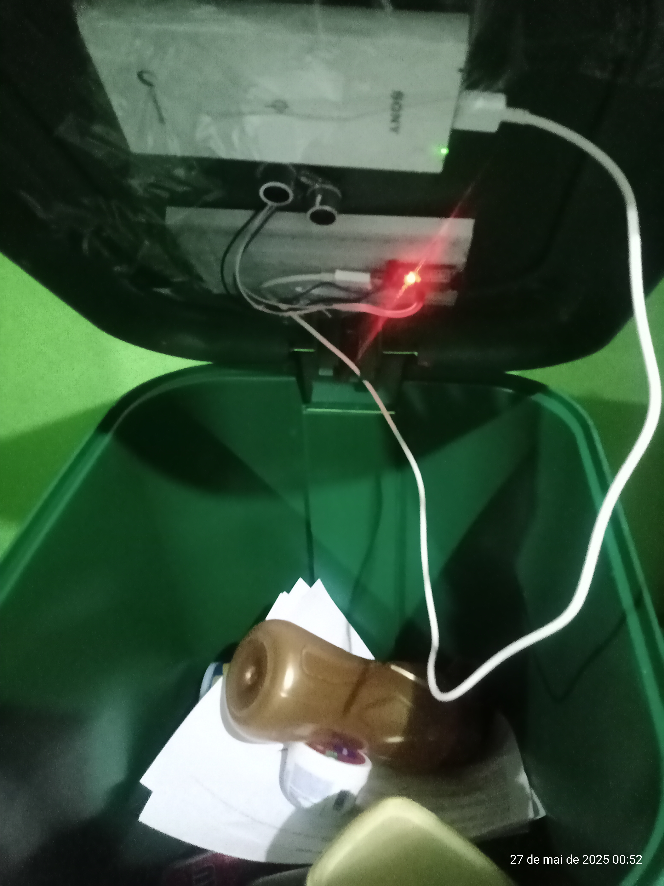

# Gerenciador de Lixeira Reciclável

Este projeto está sendo desenvovido para o trabalho da Fatec São Roque para disciplina de IOT e tem objetivo de ser capaz gerenciar os níveis das lixeiras em tempo real em diversos pontos da cidade, seja por meio da sinalização por um morador ou ainda por meio de sensores que ESP32 que são integrados ao sistema.

A empresa pode gerenciar a coleta de lixos recicláveis de uma maneira mais eficiente, se programando antecipadamente, realizando a coleta em pontos 
estratégicos. Também pode reduzir os custos traçando a melhor rota antecipadamente, coletando lixos recicláveis em pontos mais críticos. Pois o sistema será capaz de apresentar diversos dados que ajudam na tomada de decisão como, regiões com mais ou menos lixo.

Também tem objetivo de aprender e explorar um pouco mais a questão de projetar sistemas seguindo as melhores práticas no desenvolvimento de software, como a criação de componentes, serviços, gerenciamentos de estados dos componentes, aplicação de diretivas personalizadas, criação de APis, uso de websockets para informação em tempo real, trabalhar com microcontrolador ESP32 utilizando micropython e outros tópicos que poderão ser explorados ao longo do projeto.

## Funcionalidades já desenvolvidas

- Criação de grupos de lixeiras recicláveis
- Criação de lixeiras para coletas de papel, metal, vidro, orgânico.....
- Usuário pode informar niveis das lixeiras manualmente
- Usuário consegue acessar link através de QRCode gerado na tela para cada lixeira para informar status da lixeira.
- Empresa consegue visualizar grupos de lixeiras criados.
- Empresa consegue visualizar as lixeiras cadastradas por grupo
- Empresa consegue visualizar observações deixadas por cada usuário que informa o nivel da lixeiras, como também informação sobre coletas já realizadas.
- Empresa consegue visualizar se as sinalizações das lixeiras estão sendo informadas por uma pessoa, ou ainda por um dispositivo instalado nas lixeiras.
- Empresa consegue filtrar e visualizar grupos de lixeira por id_grupo, endereço(rua, bairro, cidade, estado ou cep), capacidades de cada lixeiras em litros ou ainda niveis de lixo que cada uma se encontra.
- Integração do sistema com microcontroladores ESP32 que envia dados para o sistema informando o nivel das lixeiras.
- Gráfico de acompanhamento dos niveis de lixo reciclável ao longo do tempo nas lixeiras.

## Futuras
- Ajustes


# Imagens do projeto
- [](https://github.com/joseguilherme96/sistema_gerenciador_lixeira_reciclavel/blob/f8fddfa8650bf7573296a4d1f46f303a74648278/src/assets/tela_acompanhamento_lixeiras_reciclaveis.png)

- [](https://github.com/joseguilherme96/sistema_gerenciador_lixeira_reciclavel/blob/25f74f8c33a1e9f190f744726051cedc35b58d23/src/assets/atualizacao_lixeira.png)

- [](https://github.com/joseguilherme96/sistema_gerenciador_lixeira_reciclavel/blob/4757e4a78eb1e3e1431d8539587ac248c5fdc1c8/src/assets/tela_de_atualizacao_nivel_lixeira.png)

- [](https://github.com/joseguilherme96/sistema_gerenciador_lixeira_reciclavel/blob/main/src/assets/grafico_de_acompanhamento_do_nivel_da_lixeira_reciclavel.png)

- [](src/assets/lixeira_automatizada.jpg)

## Configuração do projeto  

## Instalação

### Requisitos baseados nas versões que o projeto foi executado

Backend :

- Python >= 3.10.11 

FrontEnd

- Node >= v22.15.0

## Backend - Servidor Flask

### Instale as dependências do backend com o seguinte comando :

Dentro da pasta src/backend. Instale as dependências usando o comando abaixo, para que o servidor flask possa ser executado corretamente.

```sh

    pip install -r requirements.txt

```

### Ative o ambiente virtual

Ative o ambiente virtual na pasta src/backend/.venv/scripts/activate usando o seguinte comando dentro da pasta backend

```sh

    .venv\scripts\activate

```

### Inicie o banco de dados

Partindo da raiz do projeto, abra a pasta src/backend/app e inicie o banco de dados.

```sh

    cd src/backend/app

    flask db init

```

### Inicie o servidor Flask

Ainda dentro da pasta app. Execute o comando abaixo para iniciar o servidor flask.

```sh

    python app.py

```

### Inicie o servidor json-server

Inicie o servidor json-server para carregar os estados automaticamente dentro dos forms de pesquisa e cadastro de grupo lixeira. Está é a ultima api que ainda está mockada, mas em breve será criada definitivamente com python. Assim com já foram feitas as outras APIs que já foram migradas.

```sh

    npx json-server src/backend/db.json

```


## Frontend

### Instalação das depêndencias do Frontend

Na raiz do projeto. Instale as dependências.

```sh
    npm install
```

### Renomeie o arquivo de ambiente

Renomeie o arquivo ".env.development.example" para ".env.development"

### Defina a base URL que o Flask está sendo executado

No arquivo já renomeado para ".env.development", agora encontre a variável VITE_API_FLASK_BASE_URL e reatribua a melhor variável que corresponde ao endereço da sua base URL que o servidor Flask está sendo executado. Reatribua valores caso necessário.

Possiveis endereços que o servidor Flask possa estar sendo executado :

```sh

VITE_API_FLASK_BASE_URL_LOCAL=http://127.0.0.1:5000 # Local
VITE_API_FLASK_BASE_URL_NETWORK_1=http://192.168.1.13:5000 # Rede Wifi 1
VITE_API_FLASK_BASE_URL_NETWORK_2=http://192.168.43.243:5000 # Rede Wifi 2

```

Dentre todos as bases url,  a váriável VITE_API_FLASK_BASE_URL já está predefinida com o valor da variável VITE_API_FLASK_BASE_URL_LOCAL.

```sh

VITE_API_FLASK_BASE_URL=${VITE_API_FLASK_BASE_URL_LOCAL}

```

Caso queira executar também visualizar os dados via mobile. Verifique se o servidor flask já está sendo executado em uma rede e defina um endereço IP de sua rede wifi em umas das variaveis de rede de preferência que comece com VITE_API_FLASK_BASE_URL_NETWORK_X e reatribua a variável definida para a variavel abaixo.

```sh

VITE_API_FLASK_BASE_URL=${VITE_API_FLASK_BASE_URL_NETWORK_X}

```

Assim você está informando um valor de base url de rede onde o flask está sendo executado.

### Defina a base URL que o app(Frontend) está sendo executado

Possiveis endereços. Os valores podem ser alterados conforme sua rede.

```sh

VITE_APP_BASE_URL_LOCAL=http://localhost:5173
VITE_APP_BASE_URL_NETWORK1=http://192.168.1.13:5173

```

Já está configurado para ser executado em rede local. Conforme o padrão.

```sh

    # Define qual VITE_APP_BASE_URL_XXXXXXX está sendo usada
    VITE_APP_BASE_URL=${VITE_APP_BASE_URL_LOCAL}

```

Porém caso deseja executar via mobile. Verifique se você já está conectado a uma rede wifi, e altere o valor da variável VITE_APP_BASE_URL_NETWORK1 a um valor que correspondente a sua rede wifi.
Note caso tente escanear o QRCode da lixeira apresentado na tela da aplicação que esteja sendo executado em uma rede local, o redirecionamento não irá funcionar.


```sh

    # Define qual VITE_APP_BASE_URL_XXXXXXX está sendo usada
    VITE_APP_BASE_URL=${VITE_APP_BASE_URL_NETWORK1}

```

### Execução do frontend

```sh

    npm run dev

```

## Backend

### Configure o arquivo .env na pasta backend

Na pasta src/backend abra o arquivo .env, você verá as configurações abaixo.

```sh

# BASES URL QUE O FRONT PODE ESTAR SENDO EXECUTADO
    
VITE_APP_BASE_URL_LOCAL = 'http://localhost:5173'
VITE_APP_BASE_URL_NETWORK1 = 'http://192.168.1.13:5173'
VITE_APP_BASE_URL_NETWORK2 = 'http://192.168.43.243:5173'


ORIGENS_PERMITIDAS = ${VITE_APP_BASE_URL_LOCAL},${VITE_APP_BASE_URL_NETWORK1},${VITE_APP_BASE_URL_NETWORK2}

```

Elas mudam de acordo com a base url que o app(frontend) está sendo executado. Reatribua os valores baseados nas possiveis bases url que seu front possa estar sendo executado. Assim você estará autorizando que as origens onde o app está sendo executado sejam permitidas a consumir as APIs criadas em Flask.


## ESP32

O código na pasta ESP32 pode ser executado de duas maneiras :

- Ser executado diretamente dentro do ESP32
- Ou em modo simulação

### Código executado dentro do ESP32

Para saber como o código pode ser executado dentro de um ESP32. Consulte mais detalhes [aqui](https://github.com/joseguilherme96/sistema_gerenciador_lixeira_reciclavel/tree/main/esp32).

### Código sendo executado em modo simulação

Abra a pasta ESP32 partindo da raiz de todo o projeto.

Instale as dependências.


```sh

    pip install -r requirements.txt

```

Abra a pasta boot

Renomeie o arquivo configuracao_exemplo para configuracao.py

Abra o arquivo e edite algumas configurações Principais.

```sh

# API enviada a informação automaticamente
API_FLASK_BASE_URL_LOCAL='http://127.0.0.1:5000' # Locmal
API_FLASK_BASE_URL_NETWORK1='http://192.168.1.13:5000' # Rede Wifi 1
API_FLASK_BASE_URL_NETWORK2='http://192.168.43.243:5000' # Rede Wifi 2

API_FLASK_BASE_URL = f'${API_FLASK_BASE_URL_LOCAL}'


API_INFORMATIVO_LIXEIRA = f'${API_FLASK_BASE_URL}/cadastrar_informativo_lixeira'
API_ATUALIZAR_LIXEIRA = f'{API_FLASK_BASE_URL}/atualizar_nivel_lixeira'

```

Na variável API_FLASK_BASE_URL reatribua a ela um valor que corresponde a base url que o servidor Flask está sendo executado. Conforme padrão do servidor está sendo executado na url local 'http://127.0.0.1:5000'. Mas caso esteja sendo executado em rede, o valor deverá ser alterado.

### Ative o ambiente virtual

Ainda dentro da pasta esp32. Ative o ambiente virtual usando o seguinte comando dentro da pasta backend

```sh

    .venv\scripts\activate

```

### Execute arquivo principal

Abra a pasta boot. E execute o arquivo boot.py


```sh

    cd boot

    python boot.py

```
