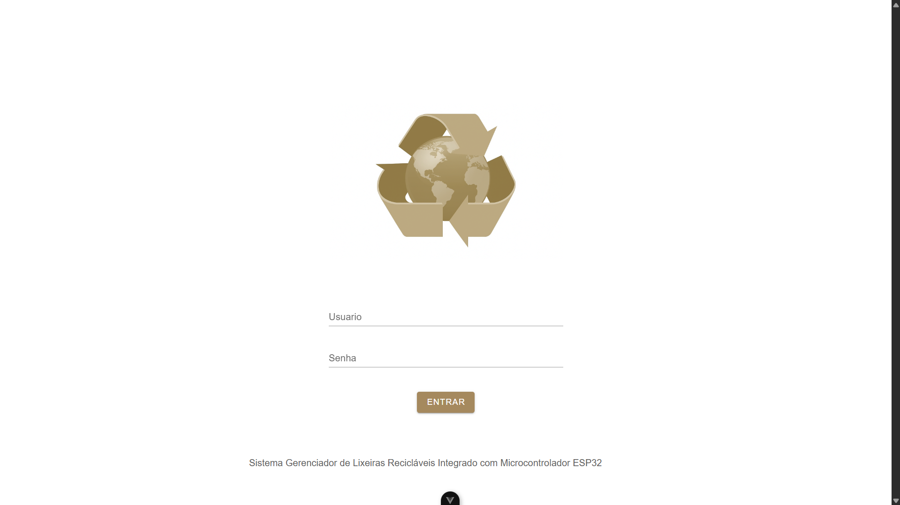

# Sistema Gerenciador de Lixeira Reciclável integrada com Microcontrolador ESP32

Este projeto foi desenvolvido para o trabalho da Fatec São Roque para disciplina de IOT(Internet das coisas) e teve objetivo de gerenciar os níveis das lixeiras em tempo real em diversos pontos da cidade, seja por meio da sinalização de um morador no próprio sistema ou ainda por meio de sensores que coletam os niveis de lixo automaticamente, o microcontrolador ESP32 recebe estas informações dos sensores, realiza o processamento e envia as informações para o sistema/servidor.

A empresa pode gerenciar a coleta de lixos recicláveis de uma maneira mais eficiente, se programando antecipadamente, realizando a coleta em pontos 
estratégicos. Também pode reduzir os custos traçando a melhor rota antecipadamente, coletando lixos recicláveis em pontos mais críticos. Pois o sistema é capaz de apresentar diversos dados que ajudam na tomada de decisão.

Este trabalho também teve objetivo de aprender e explorar um pouco mais a questão de projetar sistemas seguindo as melhores práticas no desenvolvimento de software, como a criação de componentes , serviços, gerenciamentos de estados dos componentes, aplicação de diretivas personalizadas, criação e consumo de APis, uso de websockets para informação em tempo real, controle de versão de script SQL e ainda trabalhar com processamento de informações no microcontrolador ESP32 utilizando micropython.

## Funcionalidades do Sistema

- Criação de grupos de lixeiras recicláveis
- Criação de lixeiras para coletas de papel, metal, vidro, orgânico.....
- Usuário pode informar niveis das lixeiras manualmente e também descrever o estado que as lixeiras se encontram.
- Usuário consegue acessar link através de QRCode gerado na tela para cada lixeira para informar status da lixeira.
- Empresa consegue visualizar grupos de lixeiras criados.
- Empresa consegue visualizar as lixeiras cadastradas por grupo.
- Empresa consegue visualizar observações deixadas por cada usuário que informa o nivel da lixeiras, como também informação sobre coletas já realizadas.
- Empresa consegue visualizar se as sinalizações das lixeiras estão sendo informadas por uma pessoa, ou ainda por um dispositivo instalado nas lixeiras.
- Empresa consegue filtrar e visualizar grupos de lixeira por id_grupo, endereço(rua, bairro, cidade, estado ou cep), capacidades de cada lixeiras em litros ou ainda niveis de lixo que cada uma se encontra.
- Atualização automática dos niveis de lixo em tempo real por meio de Microcontroladores que estão integrado ao sistema.
- Atualização automática em tempo real das informações das lixeiras.
- Gráfico de acompanhamento dos niveis de lixo reciclável nas lixeiras em tempo real.

### Principais Recursos/detalhes que API em Flask oferece

- Validação dos dados
- APis Modulares com Blueprints
- Persistência no banco de dados com Flask-SQLAchemy
- Controle de Transações com os principais comandos BEGIN, COMMIT e ROLLBACK.
- Acompanhamento de atividade dos Microcontroladores ESP32
- Gravação de logs gerados pelos Microcontroladores ESP32 em arquivo.
- Retorno direcionado com principais Códigos de status de Respostas HTTP 400, 404, 405, 415 e 500.
- Controle de versão do Banco de Dados com Flask-Migrate
- API WEBSOCKET para comunicação em tempo real com Flask-SocketIO

## Funcionalidades do Microcontrolador ESP32

- Permite configuração personalizada de acordo com cada lixeira que o dispositivo é implementado.
- Possui conectividade com Wifi.
- Permite calibração de altura da lixeira de acordo com cada lixeira que o ESP32 é implementado.
- Exibe e registra todas as atividades que estão sendo executadas no dispositivo em um arquivo de log que é gerado no Microcontrolador.
- Realiza leitura do nivel da lixeira.
- Coleta dados, processamento e envio das informações para o sistema/servidor.

## Arquitetura de comunicação entre clientes e APIs
[](src/assets/Arquitetura_de_comunicacentre_clientes_apis.png)

## MER - Modelo Entidade Relacionamento
[](src/assets/mer_modelo_entidade_relacionamento.png)


# Imagens do projeto

## Tela de Login
[](src/assets/tela_de_login.png)

## Listagem de grupos de lixeira
[](https://github.com/joseguilherme96/sistema_gerenciador_lixeira_reciclavel/blob/f8fddfa8650bf7573296a4d1f46f303a74648278/src/assets/tela_acompanhamento_lixeiras_reciclaveis.png)

## Informações detalhadas da lixeira
[](https://github.com/joseguilherme96/sistema_gerenciador_lixeira_reciclavel/blob/25f74f8c33a1e9f190f744726051cedc35b58d23/src/assets/atualizacao_lixeira.png)

## Tela para usuário informar o nível de lixo
[](https://github.com/joseguilherme96/sistema_gerenciador_lixeira_reciclavel/blob/4757e4a78eb1e3e1431d8539587ac248c5fdc1c8/src/assets/tela_de_atualizacao_nivel_lixeira.png)

## Gráfico de acompanhamento dos níveis de lixo na lixeira em tempo real ao longo do tempo
[](https://github.com/joseguilherme96/sistema_gerenciador_lixeira_reciclavel/blob/main/src/assets/grafico_de_acompanhamento_do_nivel_da_lixeira_reciclavel.png)

## Foto da instalação do Microcontrolador ESP32 na lixeira
[](src/assets/lixeira_automatizada.jpg)

## Acompanhamento de atividade direto no Microcontrolador ESP32 com exibição e registro de Logs
[](src/assets/acompanhamento_de_atividade_ep32_resgistro_de_logs.png)

## API em Flask
[](src/assets/API_FLASK.png)

## Configuração do projeto  

Como podem ver, projeto completo é divido até em 3 partes para facilitar sua compreensão, Frontend, Backend e pasta ESP32 com todo script para processamento no Microcontrolador. Cada umas destas partes você encontrará informações detalhadas sobre cada parte do projeto para que fosse possível o projeto ser executado por completo, possibilitando também o seu entendimento sobre partes especificas do projeto.

Aqui está os links das pastas em partes para maiores detalhes, pasta [Backend](https://github.com/joseguilherme96/sistema_gerenciador_lixeira_reciclavel/tree/main/src/backend) e pasta [ESP32](https://github.com/joseguilherme96/sistema_gerenciador_lixeira_reciclavel/tree/main/esp32) para instalação. E para maiores detalhes da pasta FrontEnd continue lendo abaixo.

## Frontend Instalação

### Versão do Node 

Aqui está a versão do Node.js que foi utilizada para execução do projeto no FrontEnd

FrontEnd

- Node >= v22.15.0

### Instalação das depêndencias do Frontend

Na raiz do projeto. Instale as dependências.

```sh
    npm install
```

### Renomeie o arquivo de ambiente

Renomeie o arquivo ".env.development.example" para ".env.development"

### Defina a base URL que o Flask está sendo executado

No arquivo já renomeado para ".env.development", agora encontre a variável VITE_API_FLASK_BASE_URL e reatribua a melhor variável que corresponde ao endereço da sua base URL que o servidor Flask está sendo executado. Reatribua valores caso necessário.

Possiveis endereços que o servidor Flask possa estar sendo executado :

```sh

VITE_API_FLASK_BASE_URL_LOCAL=http://127.0.0.1:5000 # Local
VITE_API_FLASK_BASE_URL_NETWORK_1=http://192.168.1.13:5000 # Rede Wifi 1
VITE_API_FLASK_BASE_URL_NETWORK_2=http://192.168.43.243:5000 # Rede Wifi 2

```

Dentre todos as bases url,  a váriável VITE_API_FLASK_BASE_URL já está predefinida com o valor da variável VITE_API_FLASK_BASE_URL_LOCAL.

```sh

VITE_API_FLASK_BASE_URL=${VITE_API_FLASK_BASE_URL_LOCAL}

```

Caso queira executar também visualizar os dados via mobile. Verifique se o servidor flask já está sendo executado em uma rede e defina um endereço IP de sua rede wifi em umas das variaveis de rede de preferência que comece com VITE_API_FLASK_BASE_URL_NETWORK_X e reatribua a variável definida para a variavel abaixo.

```sh

VITE_API_FLASK_BASE_URL=${VITE_API_FLASK_BASE_URL_NETWORK_X}

```

Assim você está informando um valor de base url de rede onde o flask está sendo executado.

### Defina a base URL que o app(Frontend) está sendo executado

Possiveis endereços. Os valores podem ser alterados conforme sua rede.

```sh

VITE_APP_BASE_URL_LOCAL=http://localhost:5173
VITE_APP_BASE_URL_NETWORK1=http://192.168.1.13:5173

```

Já está configurado para ser executado em rede local. Conforme o padrão.

```sh

    # Define qual VITE_APP_BASE_URL_XXXXXXX está sendo usada
    VITE_APP_BASE_URL=${VITE_APP_BASE_URL_LOCAL}

```

Porém caso deseja executar via mobile. Verifique se você já está conectado a uma rede wifi, e altere o valor da variável VITE_APP_BASE_URL_NETWORK1 a um valor que correspondente a sua rede wifi.
Note caso tente escanear o QRCode da lixeira apresentado na tela da aplicação que esteja sendo executado em uma rede local, o redirecionamento não irá funcionar.


```sh

    # Define qual VITE_APP_BASE_URL_XXXXXXX está sendo usada
    VITE_APP_BASE_URL=${VITE_APP_BASE_URL_NETWORK1}

```

### Execução do frontend

```sh

    npm run dev

```
