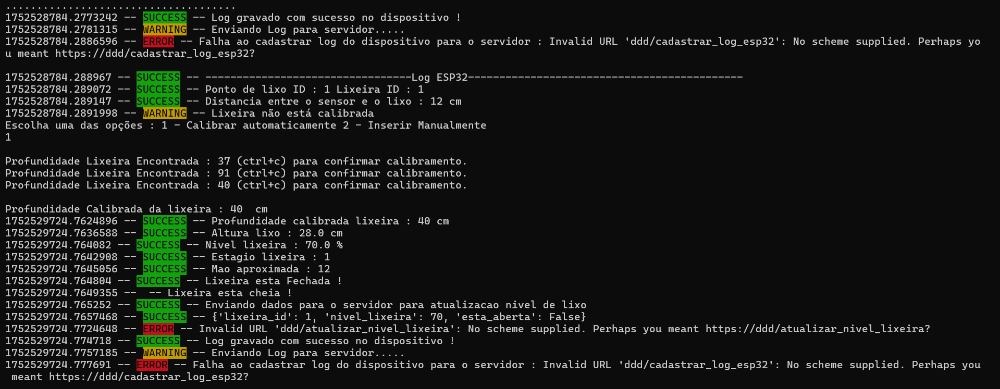

# Microcontrolador ESP32

Este é um módulo extra do sistema, além dos niveis da lixeiras poderem ser informado por usuários através do sistema, também poderão ser informados e atualizados automaticamente por dispositivos previamente configurados e instalados nas lixeiras recicláveis. Gerando dados precisos e em tempo real. Fazendo com que empresas possam se programar antecipadamente e agendar coleta de uma maneira mais eficiente. Criando rotas estratégicas.

Placas ESP32 podem ser instaladas nas lixeiras e integradas ao sistema. Automaticamente começam coletar dados, processar e enviar requisições para o sistema/API Flask.
O sistema identificando estas requisições, faz atualização do nivel da lixeira no banco de dados, e através de outra API Websocket que foi criada, todos os sistemas que estão conectados e recebem a informação que os niveis da lixeira foram atualizados em tempo real. Fazendo com que os dados sistema atualize automaticamente.

## Funcionalidades do Microcontrolador ESP32

- Permite configuração personalizada de acordo com cada lixeira que o dispositivo é implementado.
- Possui conectividade com Wifi.
- Permite calibração de altura da lixeira de acordo com cada lixeira que o ESP32 é implementado.
- Exibe e registra todas as atividades que estão sendo executadas no dispositivo em um arquivo de log que é gerado no Microcontrolador.
- Realiza leitura do nivel da lixeira.
- Coleta dados, processa e envia informações para o sistema/servidor.

## Passos que foram necessários para integrar o ESP32 ao sistema(API)

Estes foram basicamente os passos que permitiram que o ESP32 começasse a medir os niveis das lixeiras e enviar as informações para o sistema, para que pudesse ter informação em tempo real.

- Uma Placa ESP32_GENERIC
- Instalação do Python >= 3.10.11
- Driver para ESP32 para permitir computador reconhecer o dispositivo.
- Firmware Micropython para ser instalado no ESP32.
- ESPTOOL ferramenta que permite a instalação do firmware Micropython.
- Emulador Tera Term 5 para processar os primeiros comandos com python direto no ESP32.
- Pacote adafruit-ampy  1.1.0 responsável por permitir copiar scripts python criados para a placa ESP32.
- Uma classe base do python hcsr04.py para medição do nivel da lixeira.
- Criação do script para processamento das medições no ESP32 e enviar para o sistema(API).
- Implementação de todos os scripts criados no ESP32.

O código na pasta ESP32 pode ser executado de duas maneiras :

- Ser executado diretamente dentro do ESP32
- Ou em modo simulação

Na execução do boot.py pela primeira vez, ou quando desejar, a opção sempre estará disponivel para você escolher em que modo deseja executar o boot reconfigurando o arquivo, no modo simulação(no PC) ou direto no ESP32(Menos provável caso não tenha o ESP32).

# Estrutura do projeto ESP32

projeto/
├── esp32/
    └── boot/
        ├── hcsr04/
        ├── services/
        │   ├── informativo_service.py
        │   ├── lixeira_service.py
        │   ├── log_service.py
        │   └── wifi_service.py
        ├── store/
        │   └── log.py
        ├── utils/
        │   ├── calibrar_lixeira.py
        │   ├── configuracao_esp32.py
        │   ├── converte_nivel_lixeira_em_porcentagem.py
        │   ├── input_cli.py
        │   └── obter_distancia.py
        ├── boot.py
        ├── configuracao_exemplo.py
        ├── log.txt
        ├── requirements.txt


## Instalação

Abra a pasta ESP32 partindo da raiz de todo o projeto.

Instale as dependências.


```sh

    pip install -r requirements.txt

```

O arquivo boot.py pode ser configurado de duas formas para rodar no PC ou direto no ESP32. O modo de configuração manual foi a primeira versão lançada que permite que você configure linha a linha para que a execução do código possa ser realizada. Para isso vá para configuração Manual.

## Configuração Automática

A configuração automática veio para facilitar a configuração e execução do boot independente de qualquer ambiente. Mas caso queira sentir na prática como é a configuração manual pule para configuração Manual. Com a configuração automática, praticamente não a o que fazer a não ser rodar o script boot.py. Pois com a execução deste script, automaticamente o boot vai identificar que ainda não foi realizada nenhuma configuração para que o boot seja executado no pc ou ainda diretamente dentro de ESP32, então ele irá começar a fazer perguntas simples que facilita o processo de configuração, execução no pc(em modo simulação) ou direto no ESP32. Assim que o boot for configurado, ele começará será a coletar dados, processar e enviar os dados das lixeiras para o servidor como medição dos niveis de lixo, se a lixeira está aberta ou fechada.

### Execute arquivo principal

Abra a pasta boot. E execute o arquivo boot.py


```sh

    cd boot

    python boot.py

```
### Configuração do boot

Como é a primeira vez que o boot está sendo executado irá pedir algumas informações básicas conforme abaixo que permitirá que o boot já seja executado independente do ambiente configurado.

[](../src/assets/configuracao_boot_esp32.png)

### Exibição do arquivo de configuração

Após a inserção das informações, será exibido o arquivo de configuração com todas as váriáveis setadas.

[](../src/assets/exibicao_arquivo_configuracao.png)

[](../src/assets/exibicao_arquivo_configuracao_part_2.png)

### Calibração da lixeira

E a última configuração, onde será calibrado a altura da lixeira, assim para  que cada lixeira que o ESP32 é implementado, saiba exatamente qual a distância entre
a tampa onde o ESP32 e o sensor está instalado com o fundo da lixeira, assim conseguirá realizar uma dimensão precisa e realizar os cálculos corretamente para envio das informações.

A calibração pode ser de duas formas manual ou automática. Na manual o próprio técnico coloca a distância exata do sensor que está fixado na tampa da lixeira com relação ao fundo da lixeira. Outra alternativa é a calibração automática da lixeira, onde o ESP32 com o sensor já fixado na tampa com a lixeira fechada, também consegue identificar profundidade extata da lixeira. Dos dois modos possibilita que a lixeira esteje calibrada para que o sensor comece a coletar informações e envie para o servidor/sistema.

[](../src/assets/calibracao_e_inicio_coleta_envio_de_dados.png)

O processo de implementação do boot no ESP32 pode ser feita com a cópia dos arquivos da boot para o ESP32 utilizando a biblioteca adafruit-ampy  1.1.0 que é uma dos requisitos de instalação no ambiente mencionado dentro do arquivo requiments.txt deste parte do projeto.

## Configuração Manual

### Renomeie o arquivo configuracao_exemplo.py para configuracao.py

Assim você poderá começar a configuração manual para execução do script.

### Defina em qual modo o script será executado

Defina False para variável abaixo. Assim quando você pode executar o script no próprio computador. O script começará a gerar numeros aleatórios como se estivesse sendo gerado por um sensor. Mas caso defina com TRUE, o script irá considerar que o boot estará rodando no ESP32 com o sensor onde exije o uso de mais algumas classes que são executadas automaticamente podendo ocasionar erro caso não esteja no ambiente correto.

```sh

SCRIPT_SENDO_EXECUTADO_NO_ESP32 = False


```


### Defina a rede que o script será direcionado

Ainda dentro do arquivo configuracao.py, temos possíveis destinos de endereços quando as requisições são feitas para o servidor Flask, escolha a variável que contém o endereço que está sendo executado ou será exeutado o servidor Flask. Reatribua valores caso necessário. 

```sh

# Endereço de API para ser enviado a informação automaticamente
API_FLASK_BASE_URL_LOCAL='http://127.0.0.1:5000' # Local
API_FLASK_BASE_URL_NETWORK1='http://192.168.1.13:5000' # Rede Wifi 1
API_FLASK_BASE_URL_NETWORK2='http://192.168.43.243:5000' # Rede Wifi 2

API_FLASK_BASE_URL = f'${API_FLASK_BASE_URL_LOCAL}'


API_INFORMATIVO_LIXEIRA = f'${API_FLASK_BASE_URL}/cadastrar_informativo_lixeira'
API_ATUALIZAR_LIXEIRA = f'{API_FLASK_BASE_URL}/atualizar_nivel_lixeira'

```

Na variável API_FLASK_BASE_URL reatribua a ela um valor que melhor corresponde a base url que o servidor Flask está sendo ou será executado. Conforme padrão do servidor é iniciado no endereço 'http://127.0.0.1:5000'. Mas pode ser que mude caso esteja sendo executado em rede, o valor deverá ser alterado.


### Defina configurar False

```sh

# Configurações lixeira
CONFIGURAR = False

```

Como você está configurando o arquivo configuracao.py manualmente, defina como False para que no momento da execução do boot ele não queira novamente configurar
o boot. Porém caso queira que o arquivo seja configurado automaticamente siga para configuração automática.

### Ative o ambiente virtual

Ainda dentro da pasta esp32. Ative o ambiente virtual usando o seguinte comando dentro da pasta backend

```sh

    .venv\scripts\activate

```

### Execute arquivo principal

Abra a pasta boot. E execute o arquivo boot.py


```sh

    cd boot

    python boot.py

```
